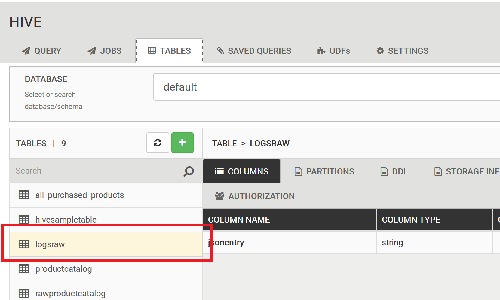

# Lab 2: Data ETL (Extract, Transform, Load)

在這份 Lab 中您將瞭解並建立資料管線 (data pipeline) 的基礎建設

## Step 1: 建立需要的 Azure 服務

  * [Azure Storage](https://azure.microsoft.com/services/storage/blobs/): 我們需要建立另一個儲存體帳號來存放 HDInsight 的資料。
  * [Azure SQL Database](https://azure.microsoft.com/services/sql-database/): 用來儲存資料 ETL 過程中的 meta data
  * [Azure HDInsight](https://azure.microsoft.com/services/hdinsight/): 在這個 Lab 中我們以 Hive 來示範 ETL 的操作，所以建立一個 Hadoop cluster 來操作。
  * (選擇性) [Azure Data Factory](https://azure.microsoft.com/services/data-factory/): 用來設定資料管線的自動化。

以下是建立資源的步驟以及建議選項。

1. 建立 Azure 儲存體帳戶，這部份的原則與 [Lab1](Lab1-Data-Ingestion.md) 操作時相似，只是這裡我們單純用它來存放 HDInsight cluster 所產生的檔案或 logs。

2. 建立 Azure SQL Database，效能可以選擇 **S0** 即可，而建立時注意位置要選擇與 Lab1 建立的資源相同的資料中心位置。

3. 建立 Azure HDInsight 資源 (注意選擇發行商為 Microsoft 的版本)：（您可以視需要自行調整叢集大小，或是保留預設值）

   * 基本設定
      * 叢集類型選擇 **Hadoop**、**Linux**、以及 **Hadoop 2.7.3 (HDI 3.6)**。
      * 帳號密碼是稍後用來登入 web 操作界面的身份認證用。
      * 位置與已建立的儲存體帳戶相同。
   * 儲存體
      * 儲存體的設定分成兩塊，一開始設定的是 HDInsight 所用的儲存體帳戶，你可以選擇稍早建立的儲存體，或是在這裡再新建一個；而在 **其他儲存體帳戶** 裡就要設定我們用來儲存資料的儲存體帳戶金鑰，這樣才能使用這個 HDInsight 來操作儲存的資料。
      * 中繼資料存放區可以將剛才建立的 SQL 資料庫設定在 _為 Hive 選取 SQL 資料庫_ 欄位。

   接下來可以要大約 20 分鐘左右，整個 cluster 才會建立完成。

## Step 2: 在 HDInsight 中載入資料並存成 Hive table

1. 根據建立的 HDInsight cluster 內容，打開瀏覽器連結 https://xxxx.azurehdinsight.net/ 登入 cluster 的 web 管理界面 (Ambari)，登入後在右上角的按鈕切換成 **Hive view**。

   


2. 提交一個 Hive query 如下 (儲存體帳號名稱，以及路徑中的日期請根據真實情況做修改) ，_這個查詢就是主要把資料從 Blob 儲存體讀進來，並且產生一個 hive table 來儲存它_。順利完成後，可以在填寫查詢的右側面板或是 _TABLE_ 頁面觀察是不是有建立 `logsraw` 的 Hive table。

    ```
    CREATE EXTERNAL TABLE IF NOT EXISTS LogsRaw (jsonentry string) PARTITIONED BY (year INT, month INT, day INT) STORED AS TEXTFILE LOCATION "wasbs://logs@example.blob.core.windows.net/";
    
    ALTER TABLE LogsRaw ADD IF NOT EXISTS PARTITION (year=2017, month=10, day=31) LOCATION "wasbs://logs@example.blob.core.windows.net/2017/10/31";
    
    SELECT * from LogsRaw limit 1;
    ```

   

3. 接著先在 Blob 儲存體中建立一個 `processeddata` 的容器，用來存放處理過的資料，然後再執行這個 Hive query 把原始資料 (raw data) 轉成表格式的資料結構，這裡我們也是以建立一個 Hive table 來完成：

    ```
    CREATE TABLE IF NOT EXISTS storeActivity (
      eventdate timestamp,
      userid string,
      productid string,
      quantity int,
      price int
    ) 
    PARTITIONED BY (year int, month int, day int) 
    ROW FORMAT DELIMITED 
    FIELDS TERMINATED BY ',' 
    LINES TERMINATED BY '\n' 
    STORED AS TEXTFILE LOCATION 'wasbs://processeddata@example.blob.core.windows.net/structuredlogs';
    
    ALTER TABLE storeActivity ADD IF NOT EXISTS PARTITION (year=2017, month=10, day=31) LOCATION 'wasbs://processeddata@example.blob.core.windows.net/structuredlogs/2017/10/31';
    ```

4. 再來就是把 `LogsRaw` 裡的資料拆解 (Extract) 後寫進 `storeActivity` 表格中：

    ```
    INSERT OVERWRITE TABLE storeActivity Partition (year, month, day) 
    SELECT 
      CAST(CONCAT(split(get_json_object(jsonentry, "$.eventdate"),'T')[0], ' ', SUBSTRING(split(get_json_object(jsonentry, "$.eventdate"),'T')[1],0,LENGTH(split(get_json_object(jsonentry, "$.eventdate"),'T')[1])-1)) as TIMESTAMP) as eventdate, 
      get_json_object(jsonentry, "$.userid") as userid, 
      get_json_object(jsonentry, "$.productid") as productid, 
      CAST(get_json_object(jsonentry, "$.quantity") as int) as quantity,
      CAST(get_json_object(jsonentry, "$.price") as int) as price, 
      year, 
      month, 
      day
    FROM LogsRaw;
    ```

   到目前為止，您已成功將 raw data 轉成表格化 (tabular) 資料，可以方便後續的分析。

5. 將商品型錄資料 (ref/catalog/catalog.json) 檔案上傳到儲存體帳戶下 (路徑就保持 `ref/catalog/catalog.json`)，然後依然可以用 Hive 將它讀入並且與我們已經建立的 hive table 做 join 的查詢。

   首先使用下列查詢把 catalog.json 的檔案內容讀入並建立 `ProductCatalog` 的 hive table。

    ```
    DROP TABLE IF EXISTS RawProductCatalog;
    CREATE EXTERNAL TABLE RawProductCatalog (
      jsonentry string
    ) 
    STORED AS TEXTFILE LOCATION "wasbs://ref@example.blob.core.windows.net/catalog/";
    
    DROP TABLE IF EXISTS ProductCatalog;
    CREATE TABLE ProductCatalog 
    ROW FORMAT DELIMITED 
    FIELDS TERMINATED BY ',' 
    LINES TERMINATED BY '\n'
    LOCATION 'wasbs://processeddata@example.blob.core.windows.net/product_catalog/'
    AS SELECT 
      get_json_object(jsonentry, "$.productId") as productId,
      get_json_object(jsonentry, "$.name") as name,
      get_json_object(jsonentry, "$.category") as category,
      get_json_object(jsonentry, "$.price") as price
    FROM RawProductCatalog;
    ```

   有了商品型錄的 table 後，要產生詳細的銷售狀況報表只需要使用這樣的 hive 查詢：

    ```
    SELECT
      a.productid, 
      b.name, 
      b.category, 
      SUM(a.quantity) as totalSold
    FROM storeActivity a 
      LEFT OUTER JOIN ProductCatalog b
      ON a.productid = b.productid
    WHERE year=2017 and month=10 and day=31
    GROUP BY 
      a.productid, 
      b.name, 
      b.category
    ORDER BY totalSold DESC;
    ```

6. 如果要計算出物品銷售之間的關聯性，也可以採用下列 hive 查詢來完成：

    ```
    DROP VIEW IF EXISTS unique_purchases;
    CREATE VIEW unique_purchases AS 
    SELECT 
      distinct userid, 
      productid
    FROM storeActivity
    WHERE eventdate > date_sub(from_unixtime(unix_timestamp()),30);
    
    DROP VIEW IF EXISTS all_purchased_products;
    CREATE VIEW all_purchased_products AS 
    SELECT 
      a.userid, 
      COLLECT_LIST(CONCAT(a.productid,',',a.qty)) as product_list FROM (
      SELECT 
        userid, 
        productid,
        SUM(quantity) AS qty 
      FROM websiteActivity
      WHERE eventdate > date_sub(from_unixtime(unix_timestamp()),30)
      GROUP BY userid, productid
      ORDER BY userid ASC, qty DESC) a
      GROUP BY a.userid;
      
    DROP VIEW IF EXISTS related_purchase_list;
    CREATE VIEW related_purchase_list AS
    SELECT
      a.userid, 
      a.productid, 
      b.product_list
    FROM unique_purchases a 
      LEFT OUTER JOIN all_purchased_products b ON (a.userid = b.userid);
      
    DROP TABLE IF EXISTS related_products;
    CREATE TABLE related_products 
    ROW FORMAT DELIMITED 
    FIELDS TERMINATED BY '|' 
    LINES TERMINATED BY '\n' 
    LOCATION 'wasbs://processeddata@example.blob.core.windows.net/related_products/' AS 
      SELECT 
        c.productid, 
        c.related_product, 
        c.qty, 
        rank() OVER (PARTITION BY c.productid ORDER BY c.qty DESC) as rank 
      FROM
        (SELECT 
          a.productid, 
          a.related_product, 
          SUM(a.quantity) as qty 
        FROM
          (SELECT 
            b.productid, 
            SPLIT(prod_list, ',')[0] as related_product, 
            CAST(SPLIT(prod_list, ',')[1] as INT) as quantity
          FROM related_purchase_list b LATERAL VIEW EXPLODE(b.product_list) prodList as prod_list) a
        WHERE a.productid <> a.related_product
        GROUP BY a.productid, a.related_product
        ORDER BY a.productid ASC, qty DESC) c;

    SELECT * from related_products;
    ```

   這樣 `related_products` 這個 Hive table 就存好了物品的關聯資訊，可以輕易做一個簡單的推薦引擎。

## Check Point

檢視是否有順利產生 `storeActivity` 以及 `related_products` 這兩個 Hive tables。

> 別忘了做完這個 lab 要把 HDInsight cluster 刪除喔，以免產生未使用的費用。