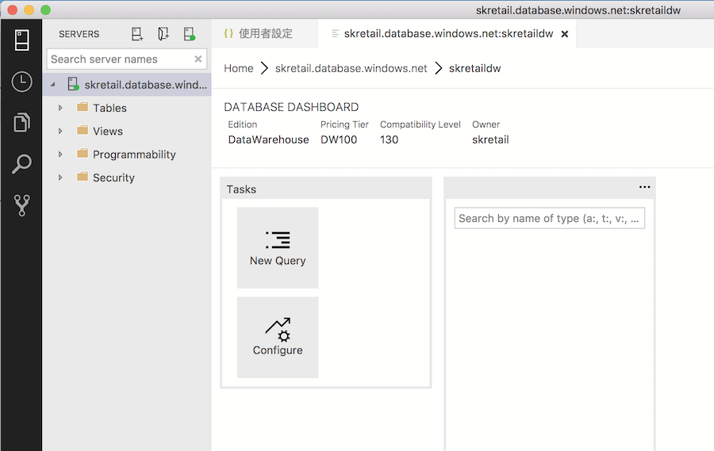
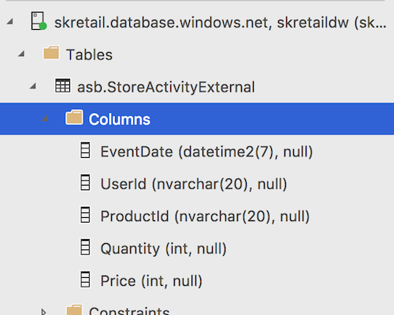

# Lab 3: Data Warehousing

在這份 lab 中，您將瞭解如何將處理好的資料 (e.g., Hive table) 以及多重資料來源整合在 data ware house 的服務中以便後續查詢與使用。

## Step 0: 建議安裝的軟體

  * [SQL Operation Studio](https://docs.microsoft.com/sql/sql-operations-studio/download)
  * [Visual Studio Code 的 mssql 外掛](https://marketplace.visualstudio.com/items?itemName=ms-mssql.mssql)

## Step 1: 建立需要的 Azure 資源

假設前兩個 lab 已經做完，在 storage 中已經有 hive table 的資料，以及原始資料的前提之下，這個 lab 僅需建立一台 SQL Data Warehouse 的服務。

建立 SQL DW 時，建議可以選用與前面 lab 相同的 SQL 伺服器，同時也確保是在相同的資料中心進行。

> 而由於 SQL DW 的單價較高，建議先將效能調整至 **DW100** 來進行 lab。做完 Lab 也請記得務必要刪除 SQL DW 的 instance。


## Step 2: 連線至 Azure SQL Data Warehouse

使用 Azure SQL Data Warehouse 的好處之一，就是它相容所有管理 SQL Server 的工具，所以您可以使用像是 SQL Server Management Studio (SSMS) 或是 Visual Studio 中的 SQL Server Data Tools (SSDT) 來管理它。而在這個 lab 中，我們使用也是由 Microsoft 官方所推出跨平台的 SQL Operations Studio 來操作我們建立的 Azure SQL Data Warehouse。

打開 SQL Operations Studio 後，你可以直接使用 hostname, username, password 等資訊來連線，或是直接做一次 Azure 帳戶登入也可以直接選擇訂閱下的 SQL DB/DW 來操作。



## Step3: 建立 Azure Storage 連線資訊

在這個 Lab 中我們要從 Azure Blob Storage 與 hive table 中把資料讀進來 (剛好都是存在 blob storage 中)，所以第一步要設定 Azure Storage 的連線資訊。

點擊 _New Query_ 的按鈕，填入下列查詢來建立連線資訊（要把帳號以及金鑰修改成你自己的內容）：

  ```sql
  IF NOT EXISTS (SELECT * FROM sys.symmetric_keys where name = '##MS_DatabaseMasterKey##')
  CREATE MASTER KEY;
  CREATE DATABASE SCOPED CREDENTIAL AzureStorageCredential WITH 
  IDENTITY = '<Azure storage account name>',
  SECRET = '<Azure storage key>';
  
  CREATE EXTERNAL DATA SOURCE AzureStorage
  WITH (
    TYPE = HADOOP,
    LOCATION = 'wasbs://processeddata@<Storage Account Name>.blob.core.windows.net',
    CREDENTIAL = AzureStorageCredential
  );
  
  CREATE EXTERNAL FILE FORMAT TextFile
  WITH (
    FORMAT_TYPE = DelimitedText,
    FORMAT_OPTIONS (FIELD_TERMINATOR = ',')
  );
  ```

如果沒有錯誤訊息，就表示建立成功。

## Step 4: 建立外部表格

接下來，我們可以在 Azure SQL Data Warehouse 中建立**外部表格** (external table) 將它關連到我們處理過資料的 hive table 中，這個步驟很簡單，只要新增一筆 SQL 查詢：

  ```sql
  CREATE SCHEMA [asb]
  GO
  
  CREATE EXTERNAL TABLE asb.StoreActivityExternal
  (
    EventDate datetime2,
    UserId nvarchar(20),
    ProductId nvarchar(20), 
    Quantity int, 
    Price int
  )
  WITH (
    LOCATION='/structuredlogs/',
    DATA_SOURCE=AzureStorage,
    FILE_FORMAT=TextFile
  );
  ```
這樣便會在 Azure SQL DW 建立一個 `asb.StoreActivityExternal` 的表格，裡面就是 hive table 內的資料，如此一來，相容 SQL Server 的工具就可以直接查詢這個表格內的資料了。


